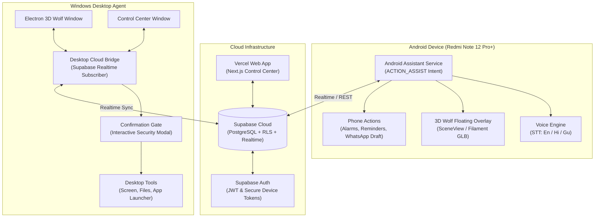

# VIC Cloud Ecosystem — System Architecture Specification

## 1. System Overview

Velmora Intelligence Commander (VIC) is transitioning from a standalone Windows desktop AI companion to a distributed, multi-surface personal assistant ecosystem. The platform consists of four interconnected tiers:

1. **Cloud Data & Realtime Core (Supabase):** PostgreSQL with Row-Level Security, authentication, and Realtime pub/sub.
2. **Cloud Control Center (Vercel):** Responsive web portal for administration, memory editing, and live auditing.
3. **Desktop Node (Windows VIC):** High-capability computing agent with local tools, screen vision, and hardware interaction.
4. **Mobile Node (Android Assistant):** Native voice assistant that integrates into Android OS as default digital assistant with 3D wolf companion overlay.

---

## 2. Component Architecture

---

## 3. Data Flow & Security Model

### Authentication & Token Isolation
- All clients (Desktop Bridge, Web App, Android) authenticate using Supabase JWT tokens.
- Anonymous/Public keys are restricted to reading/writing authorized user rows governed strictly by `auth.uid() = user_id`.
- The `service_role` key is strictly kept in secure backend server environments (Vercel Server Actions / Edge Functions) and is never distributed to clients.

### Command Execution Pipeline
1. Mobile or Web creates an action request in `device_actions` table.
2. Realtime subscription notifies the targeted desktop device.
3. Desktop Bridge receives the payload, verifies device authorization, and assesses the risk tier.
4. If risk tier > 0 (sensitive file access, execution, shell commands), the desktop displays an explicit UI Confirmation Gate.
5. Action execution output is written to `action_results` and synced back to cloud.
