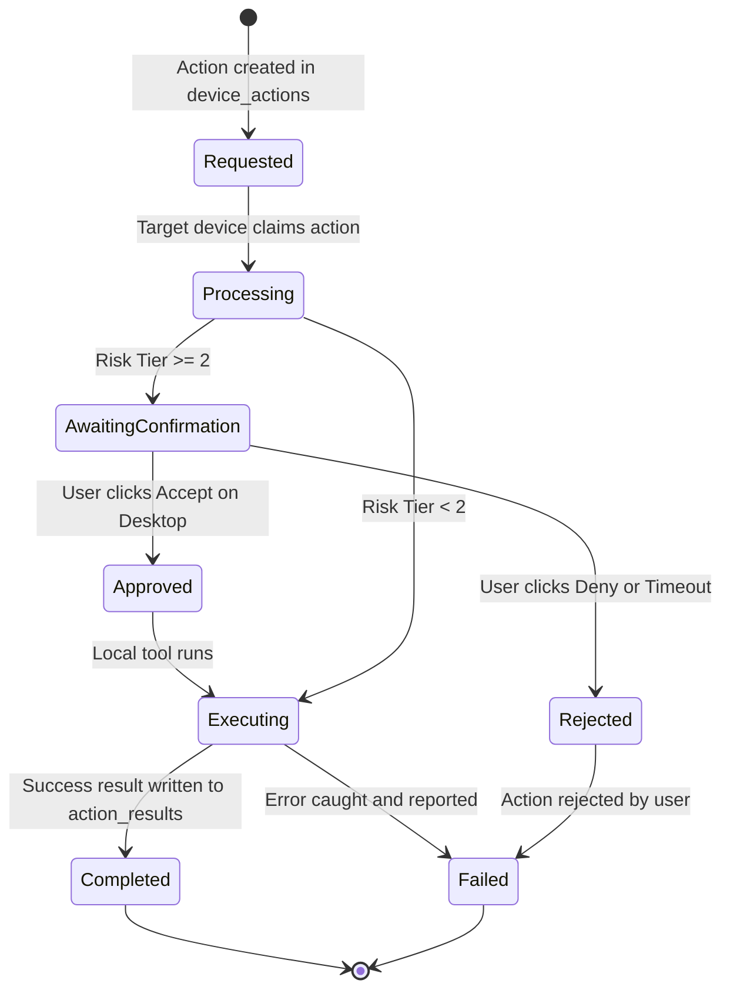

# VIC Cloud — Remote Command Protocol & Security Gates

## 1. Overview
The Remote Command Protocol allows authorized devices (such as the Android VIC assistant or Web Control Center) to request safe actions on connected desktop nodes (such as the primary Windows workstation).

## 2. Security Boundaries & Risk Tiers

To safeguard against unauthorized, destructive, or silent execution, every action is classified into a strict risk tier:

| Risk Tier | Level | Example Actions | Execution Policy |
| :--- | :--- | :--- | :--- |
| **Tier 0** | Safe / Read-Only | Ping, status query, battery level, active window title | Automatic execution |
| **Tier 1** | Standard Desktop Action | Open application (Calculator, VS Code, Browser), media controls | Logged execution; notify user |
| **Tier 2** | Sensitive Local Operation | File read, screen capture, clipboard inspection | Explicit Confirmation Gate required on desktop |
| **Tier 3** | High Risk / Forbidden | Unauthenticated shell execution, file deletion, registry editing | **PROHIBITED BY DEFAULT** |

## 3. Protocol State Machine

