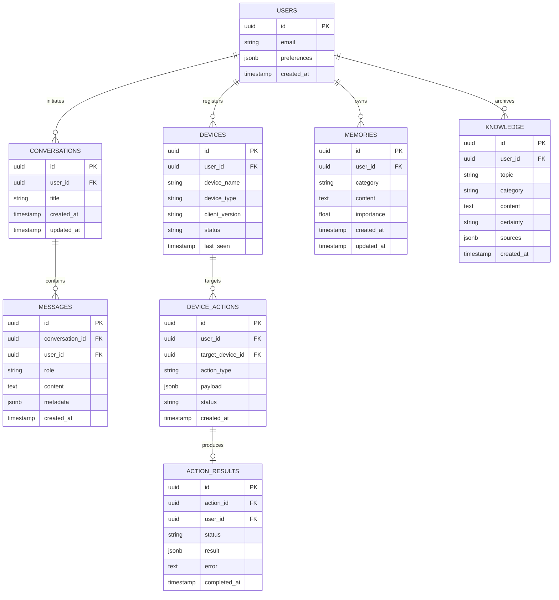

# VIC Cloud — Database Schema & Data Dictionary

## 1. Relational Entity Overview

The database is built on PostgreSQL with Row-Level Security (RLS) enabled across every table.

---

## 2. Table Specifications

### `users`
Synced with Supabase `auth.users`. Holds user profile configuration, assistant personas, and default model choices.

### `devices`
Tracks all connected surfaces:
- `device_type`: `'windows_desktop'` | `'android_phone'` | `'web_dashboard'`
- `status`: `'online'` | `'offline'` | `'busy'`
- `last_seen`: Updated via heartbeat every 30-60 seconds.

### `conversations` & `messages`
Stores multi-turn conversational history synchronized across Windows and Android devices.

### `memories`
Synchronized vault of persistent facts, user preferences, project notes, and instructions. Supports categories: `fact`, `preference`, `project`, `instruction`.

### `knowledge`
Autonomous research findings and technical learning cards generated by the Desktop or Mobile VIC agent.

### `device_actions` & `action_results`
Secure asynchronous queue for cross-device command routing (e.g., phone asking desktop to launch an application or query local files).
